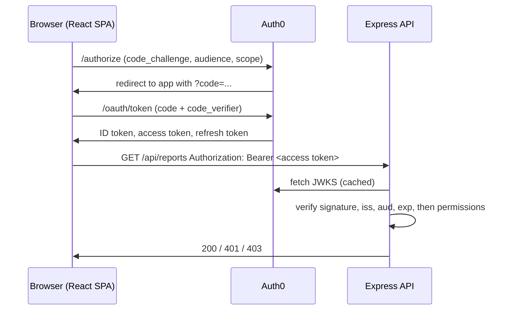

# Auth0 Identity Lab

A small React + Express project that uses Auth0 for login, API authorization and
role-based access control, built to understand what a hosted identity platform does for a
developer, and what it replaces.

- **Frontend:** React, TypeScript, Vite, `@auth0/auth0-react`
- **Backend:** Express, TypeScript, `express-oauth2-jwt-bearer`
- **Identity:** Auth0 (free tier), Authorization Code flow with PKCE, refresh token rotation, RBAC

## What it does



| Endpoint | Rule | Result |
|---|---|---|
| `GET /api/public` | none | 200 for anyone |
| `GET /api/private` | valid access token for this API | 200, or 401 |
| `GET /api/reports` | valid token **and** `read:reports` in `permissions` | 200, 401, or 403 |

The app has four pages: Home (public), Profile (protected, shows `email` and `sub`),
API calls (runs each endpoint with and without a token), and Tokens (decodes the ID token
and access token side by side).

## Run it locally

1. Configure Auth0 as described in [`docs/auth0-setup.md`](docs/auth0-setup.md).
2. Backend:
   ```bash
   cd server
   cp .env.example .env        # fill in AUTH0_DOMAIN and AUTH0_AUDIENCE
   npm install
   npm run dev                 # http://localhost:3001
   ```
3. Frontend (second terminal):
   ```bash
   cd client
   cp .env.example .env.local  # fill in domain, client ID, audience
   npm install
   npm run dev                 # http://localhost:5173
   ```

No secrets are required anywhere. The SPA is a public client with no client secret, and
the API verifies tokens with Auth0's public keys.

## What to observe

- **PKCE:** with DevTools → Network open (Preserve log on), click Log in. The request to
  `/authorize` carries `code_challenge` and `code_challenge_method=S256`. The redirect back
  to the app carries `code=`. The `/oauth/token` request sends the matching `code_verifier`.
- **Two tokens:** on the Tokens page, the ID token's `aud` is the SPA's client ID; the
  access token's `aud` is the API identifier. The API only accepts the second.
- **401 vs 403:** `viewer@` gets 403 from `/api/reports`; `analyst@` gets 200. Calling any
  protected endpoint without a token gives 401.

---

## (a) What I built by hand before

In a university team project (Higher Diploma in Software Development, Maynooth University),
I wrote the authenticated request layer for a React front end that used Firebase
Authentication. Every API call went through this layer, which:

1. attached the user's Firebase ID token as a bearer token;
2. handled token expiry by obtaining a fresh ID token from the Firebase SDK;
3. replayed the original request with the new token, so callers never saw the failure.

On the backend, the token was verified with the Firebase Admin SDK (`verifyIdToken`).

## (b) What Auth0 replaces, and how

| Concern | Hand-written version | In this project |
|---|---|---|
| Obtaining tokens safely in a browser | Handled by the Firebase SDK | Authorization Code flow with **PKCE**: the SPA proves it started the login by sending a `code_verifier` that matches the earlier `code_challenge`, instead of holding a client secret it cannot protect |
| Renewing expired tokens | Custom expiry detection + refresh + replay | `getAccessTokenSilently()` returns a cached token or renews it; with `useRefreshTokens`, renewal uses a **refresh token that Auth0 rotates** on every use |
| Refresh token theft | Not addressed | **Rotation with reuse detection**: if an old refresh token is presented again, Auth0 treats it as stolen and invalidates the whole token family |
| Verifying tokens on the API | Firebase Admin SDK `verifyIdToken` | `express-oauth2-jwt-bearer` checks the RS256 signature against Auth0's JWKS and validates `iss`, `aud` and `exp` in one middleware |
| Token meant for a different service | Not distinguished | **Audience**: the API rejects any token whose `aud` is not its own identifier, including the ID token |
| Who may do what | In application code | **RBAC in the dashboard**: roles and permissions are assigned in Auth0 and arrive as a `permissions` claim; the API only checks the claim |

## (c) Where the hand-written version stops

These are boundaries of that design, and the reasons a managed platform exists.

**Token storage.** Token persistence was left to the Firebase client SDK, which by default
keeps the session in browser storage (IndexedDB). Anything readable by JavaScript on the
page is readable by an XSS payload.
This project keeps tokens in memory (`cacheLocation="memory"`), which removes the
persistent copy but costs a session on full page reload unless silent renewal succeeds.
The stronger option, a backend-for-frontend holding tokens in `HttpOnly` cookies, moves
the problem off the browser entirely.

**Concurrent requests during refresh.** If five requests fail at once with an expired
token, a naive layer starts five refreshes. With rotating refresh tokens this is worse than
wasteful: the second refresh presents an already-used token, which (outside Auth0's configurable
reuse interval) triggers reuse detection and logs the user out. The fix is a single in-flight refresh promise that all callers await;
the Auth0 SDK does this internally.

**Revoking tokens already issued.** A JWT access token is valid until `exp`, because the API
verifies it locally without asking the issuer. Removing a role in the dashboard does not
change tokens that already exist; I observed this directly when assigning the `analyst`
role, which only took effect after logging in again. The standard mitigations are short
access token lifetimes, revoking the refresh token so no new access tokens are issued, or
token introspection where immediate revocation matters more than latency.

## Security notes

- `.env` and `.env.local` are gitignored; only `.env.example` files with placeholders are
  committed. Run `./scripts/check-secrets.sh` before pushing.
- The client decodes tokens for display only. All authorization decisions are made by the
  API after signature verification.
- `withAuthenticationRequired` on the front end is a user-experience guard, not a security
  boundary. The API is the boundary.
